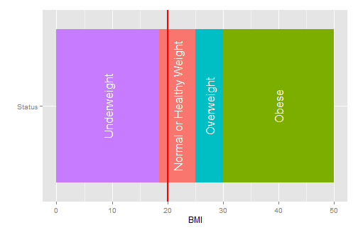

<style>

.footer {
    color: purple; background: #E8E8E8;
    position: fixed; top: 92%;
    text-align:center; width:100%;
}
.small-code pre code {
  font-size: 1em;
}
</style>

<div class="footer" style="margin-top;font-size:100%;"> 
Developing Data Products Course Project on Coursera </div>

Body Mass Index (BMI) Calculator
========================================================
author: Kayode John Olusola
date: October 22, 2015
transition: rotate

<small> 
Course Project   
Developing Data Products   
Johns Hopkins University Data Science Specialization offered on Coursera 
</small>

Introduction
========================================================
Body Mass Index (BMI) is a person's **Weight** in **kilograms** divided by the square of the person's **Height** in **meters**. 

BMI is also a person's **Weight** in **pounds** divided by the square of the person's **Height** in **inches** when the result is multiplied by *703*.

This app generates BMI values interactively.
***

BMI can be used to classify a person into different weight categories which include:
- Underweight
- Normal or Healthy Weight
- Overweight
- Obese

The BMI Calculator app also show Weight Categories by BMI values computed.

BMI Calculator: Features
========================================================

Use this link [https://jkayode.shinyapps.io/appBMI](https://jkayode.shinyapps.io/appBMI) to access the BMI Calculator app.

The app contains documentation and the following features:
- A side panel to specify *Standard* or *Metric* Measurements for Height and Weight
- Main panel to
    + Render BMI calculation
    + Display a BMI-Weight Category Table
    + Render plot with slider showing Weight Category by BMI.


BMI Calculator: Features (Cont'd)
========================================================
class: small-code

<div class="footer" style="margin-top:-50px;color:black;font-size:70%;">
Note:<em> BMI interpretation shown above applies only to Adults above 20 years of age.</em></div>

BMI values can be interpreted using the table below

<table>
<caption>Weight Categories by BMI</caption>
 <thead>
  <tr>
   <th style="text-align:left;"> BMI </th>
   <th style="text-align:left;"> Weight Status </th>
  </tr>
 </thead>
<tbody>
  <tr>
   <td style="text-align:left;"> Below 18.5 </td>
   <td style="text-align:left;"> Underweight </td>
  </tr>
  <tr>
   <td style="text-align:left;"> 18.5 - 24.9 </td>
   <td style="text-align:left;"> Normal or Healthy Weight </td>
  </tr>
  <tr>
   <td style="text-align:left;"> 25.0 - 29.9 </td>
   <td style="text-align:left;"> Overweight </td>
  </tr>
  <tr>
   <td style="text-align:left;"> 30.0 and Above </td>
   <td style="text-align:left;"> Obese </td>
  </tr>
</tbody>
</table>

***

Weight categories for Adults can be visualized on this plot


```r
myplot(20) # Showing Plot at BMI=20
```

 


Final Remarks
========================================================
transition: linear
type: subsection

## Conclusion

The BMI Calculator can provide easy means for assessing Weight Status.

Interpretation of BMI Weight Categories for children is not provided on the app documentation however, a [link](http://www.cdc.gov/healthyweight/assessing/bmi/adult_bmi/index.html) to further information was provided.

The codes for the BMI Calculator app can be found on [github](https://github.com/jkayode/devDataProducts)

## Reference

[http://www.cdc.gov/healthyweight/assessing/bmi/index.html](http://www.cdc.gov/healthyweight/assessing/bmi/index.html)
